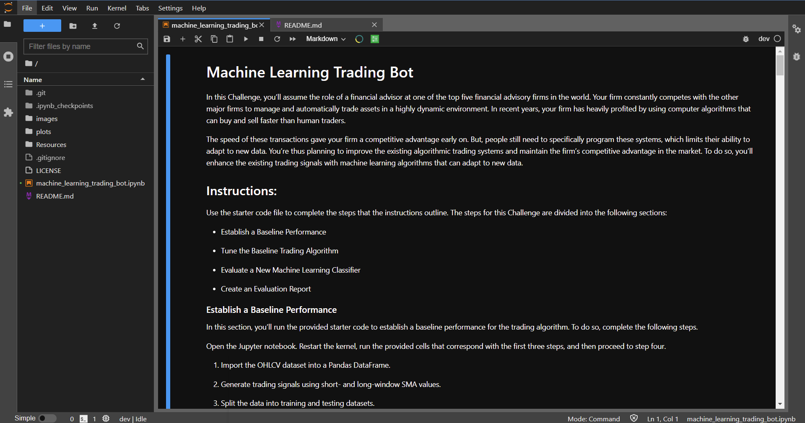

# Machine Learning Based Algorithmic Trading

An algorithmic trading strategy based on machine learning.  Each model is trained on an emerging markets ETF issued by iShares.

<div class="row">
  <div class="column">
      
    </div>
</div>


> Creates and optimizes two machine learning, algorithmic trading strategies on the emerging markets ETF issued by iShares. 

## Overview of the Analysis

Creating a trading strategy based on machine learning requires both choosing the appropriate inputs for feeding into the model and the best model that fits the data.  Factors such as the amount of training data, length of the time windows used in the simple moving averages (SMA's), and the type of machine learning model play important roles in optimization.

* The purpose of this analysis is to evaluate the cumulative trading returns of a Machine Learning Model using an SMA trading strategy, as well as optimizing this strategy.  The dataset is taken from an emerging markets ETF issued by iShares.  

* The features of the training and testing of the model will include:
    1) The shorter time window Simple Moving Average of the ETF price
    2) The longer time window Simple Moving Average of the ETF price


* The machine learning model will then generate and predict trading signals based on these SMA's.  For this data set, the signal generated to buy a stock is 1, and the signal generated to sell a stock is -1.

* This analysis will consider the logistic regression model for predicting the loan status from the features.  It will follow the standard machine learning practice of initializing the model, fiting the model, using the model to predict loan status outcomes, and comparing the predictions to the known values.  The analysis will be run two times as follows:

* After the models have run, their results will be compared using a classification report, as well as their cumulative returns.

---
## Technologies

This project is written using a ```Jupyter Lab 3.2.1``` notebook running  ```Python 3.7.11```.  The key libaries are the ```scikit-learn 1.0.2``` for implementing the logistic regression model and the ```imbalanced-learn 0.7.0``` for implementing the oversampling of the minority dataset and imbalanced classification reports.

---

## Installation Guide

Before running the application, first install the following packages if you don't already have them installed in your development environment.

```python
  pip install jupyterlab
```

To install the hvplot graphics package, run the following command on your command line:
```python
pip install hvplot
```

The scikit-learn libary is automatically installed with the Anaconda installation.  To confirm the install and version number of your scikit-learn libary, run the following command on your command line:
```python
conda list scikit-learn
```
If scikit-learn is not already installed in your environment, run the following in your command line:
```python
pip install -U scikit-learn
```

After a successful installation, ```cd``` into the top folder of the repository.  Then open ```Jupyter Lab``` by typing:
```python
jupyter lab
```
The analysis is performed in the jupyter notebook file named ```machine_learning_trading_bot.ipynb```.  

---

## Usage

To view the jupyter notebook used in this analysis, open the ```machine_learning_trading_bot.ipynb``` file in a jupyter notebook and run the cells.

The notebook should look like the screenshot below:




## Results


The initial Machine Learning model employed uses an SVC classifier model from the support vector machine.  The metrics fed to the original SVC model were:

| Metric | Value | 
| -------: | :--------:  |   
| Training Data Length:  |   3 months  |
| SMA_Fast:|   4 days  |
| SMA_Slow:|   100 days  |

This model produced a classification model with the following characteristics:

  | Trading Action | Accuracy | Precision  | Recall | f1 | 
  | -------:          |  :--------:  |   :------:    | :------:  |:-------:  |
  | Sell (-1):  |   55 %  |     43 %   |   4 % | 7 % |
  | Buy (+1):|   -same-  |    56 %   |   96 % | 71 %  |

Compared to the actual returns of the original data set, the cumulative returns on the algorithmic trading over the surveyed period are displayed below:


After running the original model, the training data is sliced into different periods.  For this study, the data is sliced into 3 different time periods: 1 month, 6 months, and 1 year.

For 1 month:

| Metric | Value | 
| -------: | :--------:  |   
| Training Data Length:  |   1 months  |
| SMA_Fast:|   4 days  |
| SMA_Slow:|   100 days  |

This model produced a classification model with the following characteristics:

  | Trading Action | Accuracy | Precision  | Recall | f1 | 
  | -------:          |  :--------:  |   :------:    | :------:  |:-------:  |
  | Sell (-1):  |   55 %  |     37 %   |   3 % | 6 % |
  | Buy (+1):|   -same-  |    56 %   |   96 % | 70 %  |

Compared to the actual returns of the original data set, the cumulative returns on the algorithmic trading over the surveyed period are displayed below:


* Compared to the original model, the model with the shorter training window had a much lower precision and recall in correctly predicting the best time to sell.  As a result, the model deviated much more from the actual returns and had a slightly lower overall cumulative return.

For 6 months:

| Metric | Value | 
| -------: | :--------:  |   
| Training Data Length:  |   6 months  |
| SMA_Fast:|   4 days  |
| SMA_Slow:|   100 days  |

This model produced a classification model with the following characteristics:

  | Trading Action | Accuracy | Precision  | Recall | f1 | 
  | -------:          |  :--------:  |   :------:    | :------:  |:-------:  |
  | Sell (-1):  |   56 %  |     44 %   |   2 % | 4 % |
  | Buy (+1):|   -same-  |    56 %   |   98 % | 71 %  |

Compared to the actual returns of the original data set, the cumulative returns on the algorithmic trading over the surveyed period are displayed below:


* Compared to the original model, the model with the longer training window of 6 months had a higher accuracy and precision in predicting the sell side.  The recall of the sell side fell by 1%.  Nevertheless, this longer training model had a larger overall cumulative return than the original model.

For 1 year:

| Metric | Value | 
| -------: | :--------:  |   
| Training Data Length:  |   12 months  |
| SMA_Fast:|   4 days  |
| SMA_Slow:|   100 days  |

This model produced a classification model with the following characteristics:

  | Trading Action | Accuracy | Precision  | Recall | f1 | 
  | -------:          |  :--------:  |   :------:    | :------:  |:-------:  |
  | Sell (-1):  |   56 %  |     0 %   |   0 % | 0 % |
  | Buy (+1):|   -same-  |    56 %   |   100 % | 72 %  |

Compared to the actual returns of the original data set, the cumulative returns on the algorithmic trading over the surveyed period are displayed below:


* Compared to the original model, the model with the longer training window of 12 months had a slightly higher accuracy, but the precision and recall of the sell side fell to 0.  This training model produced the same overall cumulative return as the actual return from the asset.  The long training period seem to have overfit the data and did not produce a viable algorithmic trading strategy.


* Summary of training study: Lowering the training size, decreases the overall cumulative return, while increasing the training period to 6 months, increases the overall cumulative return.  However, increasing the training period to 12 months, decreases the overall performance and overfits the dataset.

**From this survey, it seems the training period of 6 months produces the largest cumulative return.**

Next, the simple moving averages can be adjusted to see which average optimizes the return.  The training set of 6 months will be used going forward.

4 alterations of the Simple Moving Average time windows will be tried as well:

| Metric | Value | 
| -------: | :--------:  |   
| Training Data Length:  |   6 months  |
| SMA_Fast:|   4 days  |
| SMA_Slow:|   150 days  |

Cumulative Returns:


**The cumulative returns improved over the original SMA windows.**

---

| Metric | Value | 
| -------: | :--------:  |   
| Training Data Length:  |   6 months  |
| SMA_Fast:|   4 days  |
| SMA_Slow:|   200 days  |

Cumulative Returns:


**The cumulative returns declined over the original SMA windows.**

---

| Metric | Value | 
| -------: | :--------:  |   
| Training Data Length:  |   6 months  |
| SMA_Fast:|   2 days  |
| SMA_Slow:|   150 days  |

Cumulative Returns:


**The cumulative returns declined over the original SMA windows.**

---

| Metric | Value | 
| -------: | :--------:  |   
| Training Data Length:  |   6 months  |
| SMA_Fast:|   8 days  |
| SMA_Slow:|   150 days  |

Cumulative Returns:


**The cumulative returns declined over the original SMA windows.**

---
* To Summarize the survey of Simple Moving Averages:  The cumulative returns increased the most significantly by increasing the slow simple moving average from 100 days to 150 days.  Increasing the slow moving average to 200 days decreased the cumulative returns.  The fast SMA seemed to already be optimized at 4 days, as decreasing and increasing this value decreased the overall returns.  


**Going forward, the optimal parameters to choose are:**

| Metric | Value | 
| -------: | :--------:  |   
| Training Data Length:  |   6 months  |
| SMA_Fast:|   4 days  |
| SMA_Slow:|   150 days  |

**Optimal Cumulative Returns**


### Alternative Machine Learning Model

* The final step will be to evaluate an alternative machine learning model and its associated performance.  Since a discrete outcome is the prediction, a logistic regression model (LogisticRegression) from sci-kit learn will be employed.

* After building the model and running it with the original parameter set from the previous study, the following classification report is generated:

  | Trading Action | Accuracy | Precision  | Recall | f1 | 
  | -------:          |  :--------:  |   :------:    | :------:  |:-------:  |
  | Sell (-1):  |   52 %  |     44 %   |   33 % | 38 % |
  | Buy (+1):|   -same-  |    56 %   |   66 % | 61 %  |

Compared to the actual returns of the original data set, the cumulative returns on the algorithmic trading over the surveyed period are displayed below:


In comparing with the original machine learning model employing SVC, the logistic regression has a higher precision and recall on the sell side, but a lower precision and recall on the buy side.  The overall cumulative return is much less than the return generated by the SVC model and it performs worse than the actual returns.

## Summary Evaluation Report

This report analyzed the performance of a machine learning algorithm and attempted to optimize the performance using various training data time frames, simple moving average time frames, and an alternative machine learning algorithm.  

The original model using an SVC classifier model had a cumulative return over the 5 and a half year period:


Through a series of optimizations, the optimal training and averaging windows to employ on the strategy are increasing the training time to 6 months and increasing the slow moving average from 100 to 150 days.  This results in a cumulative return as the following:


This increases the overall cumulative return by over 30 %.  

An alternative model using a linear logistic regression was also applied to the strategy.  While the recall and precision for the sell-side prediction were much greater than the SVC model, the performance was drastically worse.  Employing the linear logistic regression resulted in a performance worse than the actual return of the asset.  

Thus the best trading strategy for the iShares ETF are the following:

| Metric | Value | 
| -------: | :--------:  |  
| ML Model: | SVC classifier model  |   
| Training Data Length:  |   6 months  |
| SMA_Fast:|   4 days  |
| SMA_Slow:|   150 days  |


## Data Sources

The iShares ETF data used in this report can be found in the Resources directory: ```./Resources/emerging_markets_ohlcv.csv```.  The data is provided by the course materials from a UCBerkeley Fintech Extension program.  

---

## Contributors

The seed code is from the course material from a UCBerkeley Extension program.  This analysis is written and performed by John Gruenewald.<br><br>
For more information, contact **John Gruenewald**:<br>
**e-mail:** [john.h.gruenewald@gmail.com](mailto:john.h.gruenewald@gmail.com)<br> **linked-in:**  [jhgruenewald](https://www.linkedin.com/in/jhgruenewald/)<br>**twitter:**  [@GruenewaldJohn](https://twitter.com/GruenewaldJohn)<br>**medium:**  [@comput99](https://medium.com/@comput99)

---

## License

MIT License

Copyright (c) 2022 John Gruenewald